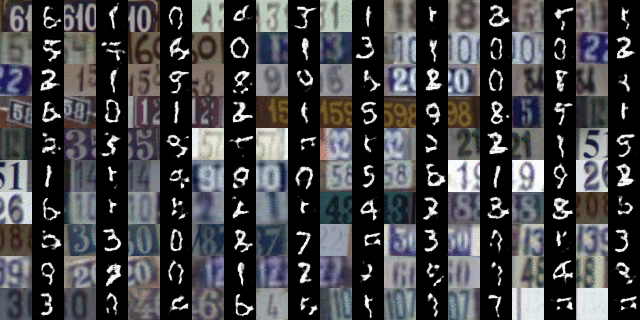
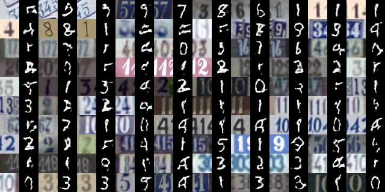

# Domain Transfer Network (DTN) 
TensorFlow implementation of [Unsupervised Cross-Domain Image Generation.](https://arxiv.org/abs/1611.02200)


## Requirements
* [Python 2.7](https://www.continuum.io/downloads)
* [TensorFlow 0.12](https://github.com/tensorflow/tensorflow/tree/r0.12)
* [Pickle](https://docs.python.org/2/library/pickle.html)
* [SciPy](http://www.scipy.org/install.html)

<br>

## Usage

#### Clone the repository
```bash
$ git clone https://github.com/yunjey/dtn-tensorflow.git
$ cd dtn-tensorflow
```

#### Download the dataset
```bash
$ chmod +x download.sh
$ ./download.sh
```

#### Resize MNIST dataset to 32x32 
```bash
$ python prepro.py
```

#### Pretrain the model f
```bash
$ python main.py --mode='pretrain'
```

#### Train the model G and D
```bash
$ python main.py --mode='train'
```

#### Transfer SVHN to MNIST
```bash
$ python main.py --mode='eval'
```
<br>

## Results: SVHN to MNIST Generation





